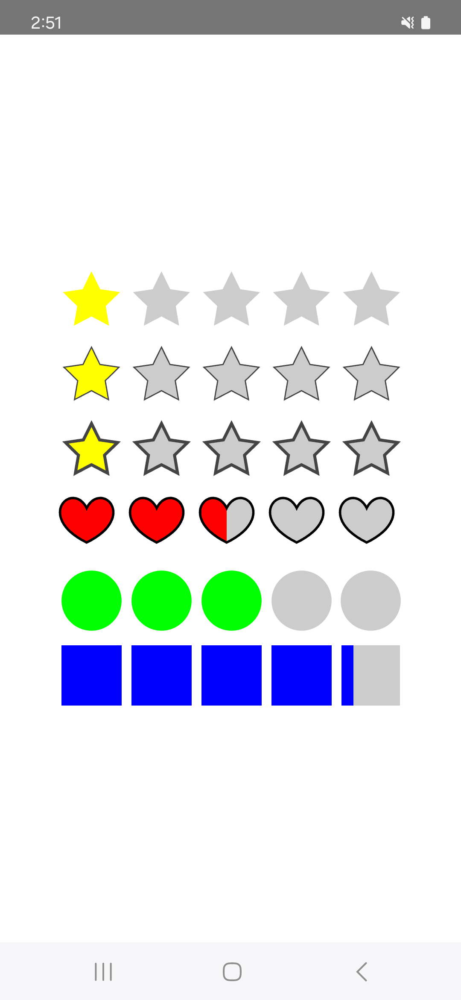
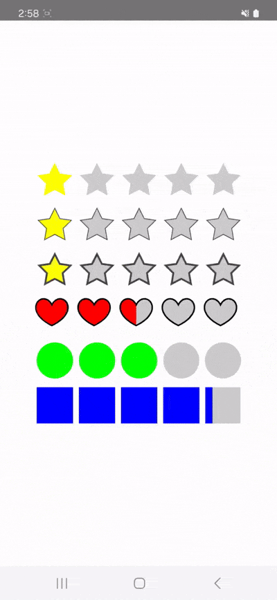

# ComposeRatingBar (한글)

**ComposeRatingBar**는 Jetpack Compose를 사용하여 별, 하트, 원형 등의 다양한 도형으로 구성된 평가 바를 쉽게 만들 수 있는 라이브러리입니다. 이 라이브러리는 사용자 정의 가능한 크기, 색상, 테두리 및 다양한 도형 스타일을 지원합니다.

<div style="display: flex; gap: 20px; align-items: center; justify-content: center;">
  
  
</div>

## 라이브러리 설치 방법

### 1. Gradle에 JitPack Repository 추가

**build.gradle** (프로젝트 수준) 파일에 JitPack을 추가하세요.

```gradle
allprojects {
    repositories {
        google()
        mavenCentral()
        maven { url 'https://jitpack.io' }
    }
}
```

### 2. 의존성 추가

**build.gradle** (모듈 수준) 파일에 **ComposeRatingBar** 의존성을 추가합니다.

```gradle
dependencies {
    implementation 'com.github.blueland99:ComposeRatingBar:1.0.0'
}
```

## 사용 방법

### 기본 사용법

**RatingBar**는 기본적으로 5개의 별로 평가를 제공합니다. 사용자가 클릭하여 평가를 변경할 수 있습니다.

```kotlin
import com.blueland.rating_bar.RatingBar
import com.blueland.rating_bar.ShapeType

@Composable
fun RatingExample() {
    RatingBar(
        rating = 3.5, // 현재 평가
        onRatingChanged = { newRating ->
            // 평가 값이 변경되었을 때 실행될 콜백
            println("New Rating: $newRating")
        },
        shapeType = ShapeType.Star, // 별 모양
        selectColor = Color.Yellow, // 선택된 색상
        unselectColor = Color.Gray, // 선택되지 않은 색상
        borderColor = Color.Black, // 테두리 색상
        borderWidth = 2.dp, // 테두리 두께
        size = 40.dp, // 도형 크기
        stepSize = 0.5 // 평가 값 증가 단위
    )
}
```

### 사용자 지정 도형

**RatingBar**에서는 **ShapeType**을 사용하여 다양한 도형을 선택할 수 있습니다.

- **ShapeType.Star**: 별 모양
- **ShapeType.Circle**: 원 모양
- **ShapeType.Square**: 사각형 모양
- **ShapeType.Heart**: 하트 모양

```kotlin
RatingBar(
    rating = 3.0,
    onRatingChanged = { newRating -> /* Handle rating change */ },
    shapeType = ShapeType.Heart, // 하트 모양 사용
    selectColor = Color.Red,
    unselectColor = Color.Gray
)
```

## 라이브러리 기능

- **다양한 도형 지원**: 별, 원, 사각형, 하트 도형을 지원합니다.
- **색상 및 테두리 사용자화**: 선택된 색상, 선택되지 않은 색상 및 테두리 색상을 지정할 수 있습니다.
- **반응형 크기**: **dp** 단위로 크기를 조정할 수 있으며, 테두리 크기 변경에 따른 크기 자동 조정이 가능합니다.
- **부분 채우기 지원**: 평가 바는 부분적으로 채울 수 있으며, 이를 통해 미세 조정이 가능합니다.

---

# ComposeRatingBar (English)

**ComposeRatingBar** is a library for Jetpack Compose that allows you to easily create rating bars with stars, hearts, circles, and other customizable shapes. The library supports user-defined sizes, colors, borders, and various shape styles.

## Installation

### 1. Add JitPack Repository to Gradle

Add JitPack to your **build.gradle** (project level) file:

```gradle
allprojects {
    repositories {
        google()
        mavenCentral()
        maven { url 'https://jitpack.io' }
    }
}
```

### 2. Add Dependency

Add the **ComposeRatingBar** dependency to your **build.gradle** (module level) file:

```gradle
dependencies {
    implementation 'com.github.blueland99:ComposeRatingBar:1.0.0'
}
```

## Usage

### Basic Usage

The **RatingBar** provides a default rating system with 5 stars. Users can click to change the rating.

```kotlin
import com.blueland.rating_bar.RatingBar
import com.blueland.rating_bar.ShapeType

@Composable
fun RatingExample() {
    RatingBar(
        rating = 3.5, // Current rating
        onRatingChanged = { newRating ->
            // Callback triggered when the rating changes
            println("New Rating: $newRating")
        },
        shapeType = ShapeType.Star, // Star shape
        selectColor = Color.Yellow, // Selected color
        unselectColor = Color.Gray, // Unselected color
        borderColor = Color.Black, // Border color
        borderWidth = 2.dp, // Border thickness
        size = 40.dp, // Shape size
        stepSize = 0.5 // Step increment for rating
    )
}
```

### Custom Shapes

The **RatingBar** allows you to select various shapes using **ShapeType**.

- **ShapeType.Star**: Star shape
- **ShapeType.Circle**: Circle shape
- **ShapeType.Square**: Square shape
- **ShapeType.Heart**: Heart shape

```kotlin
RatingBar(
    rating = 3.0,
    onRatingChanged = { newRating -> /* Handle rating change */ },
    shapeType = ShapeType.Heart, // Using heart shape
    selectColor = Color.Red,
    unselectColor = Color.Gray
)
```

## Features

- **Supports various shapes**: Stars, circles, squares, and hearts.
- **Customizable colors and borders**: Define selected, unselected, and border colors.
- **Responsive size**: Adjust sizes with **dp** units and automatically scale with border size changes.
- **Partial filling support**: Enables fine-grained control over rating values.
